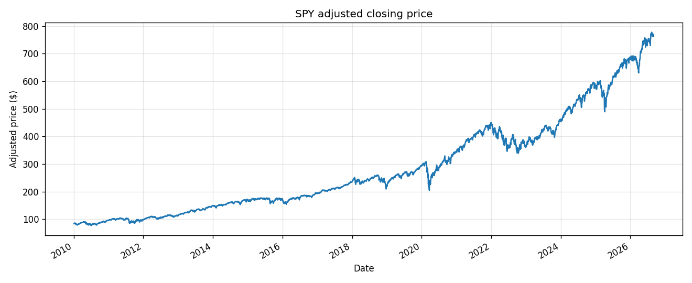
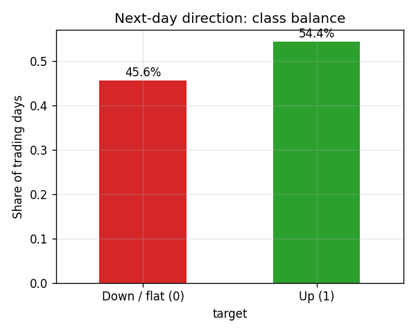
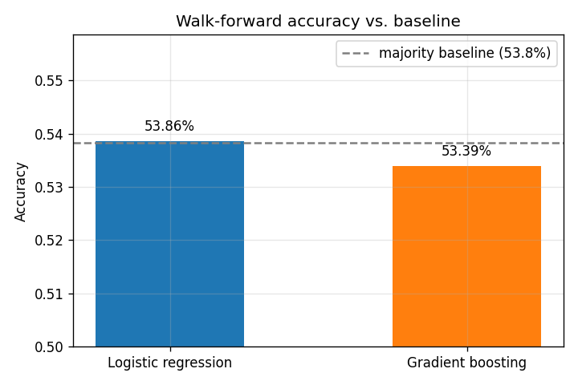
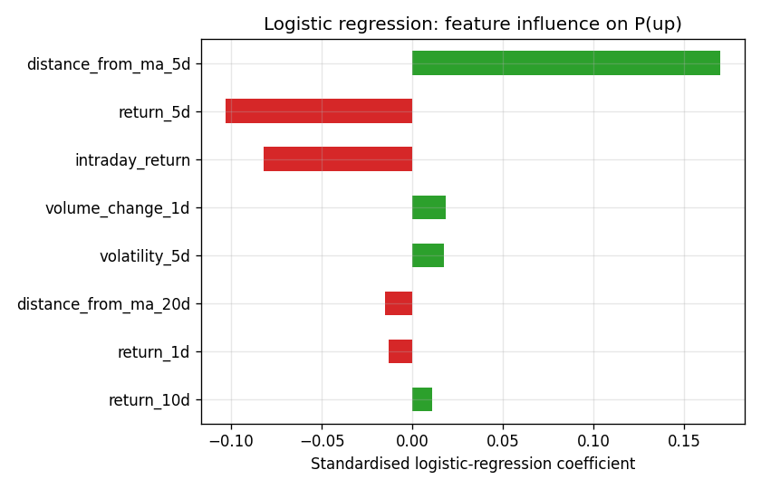
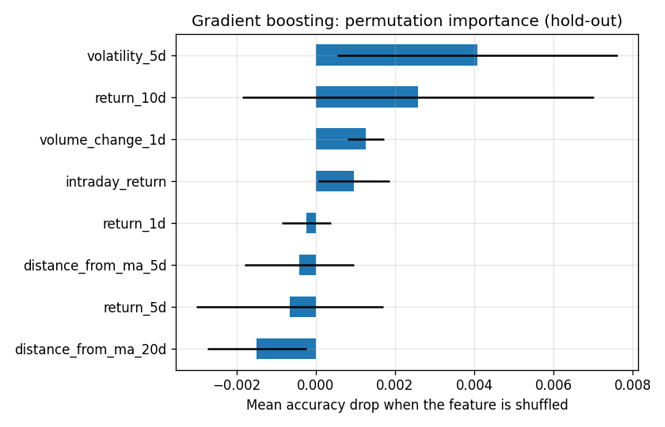
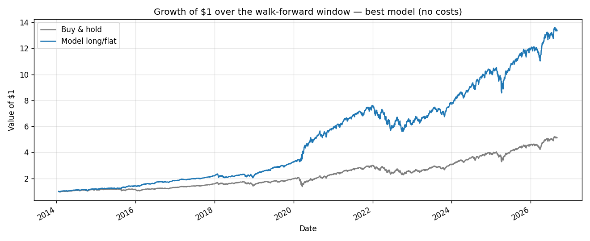

# stock-direction-predictor

Predicting the **next trading day's direction** for the S&P 500 ETF (SPY) from
daily price and volume data — with time-series validation that does not cheat.

The headline result is deliberately unglamorous: neither a logistic regression
nor a gradient-boosted tree ensemble **beats a majority-class baseline** once it
is evaluated with a walk-forward backtest. The value of this repo is the
*methodology* — leak-free features, chronological splits, an expanding-window
backtest, honest baselines, and knowing when to stop.

## Problem setup

| | |
|---|---|
| **Asset** | SPY (SPDR S&P 500 ETF), daily bars, adjusted for splits/dividends |
| **Sample** | 2010 → present, ~4,200 usable trading days after feature warm-up |
| **Target** | `1` if the next trading day closes above its open, else `0` |
| **Baseline** | Always predict the most common class in the training window (~54%) |
| **Models** | `StandardScaler` → `LogisticRegression` (L2); `HistGradientBoostingClassifier` |

Features (all computed from information available by today's close, so there is no
look-ahead leakage into the label):

- trailing close-to-close returns over 1 / 5 / 10 days
- distance of the close from its 5- and 20-day moving averages
- 5-day realised volatility of daily returns
- 1-day change in traded volume
- today's intraday return (close / open − 1)

## Results

Data: SPY daily bars, 2010-02-01 → 2026-09-02 (4,173 usable trading days).

| Model | Evaluation | Predictions | Accuracy | Baseline | Edge | Balanced acc. | ROC AUC |
|---|---|---:|---:|---:|---:|---:|---:|
| Logistic regression | Chronological hold-out (last 20%) | 835 | 54.13% | 54.01% | +0.12% | 50.15% | 0.518 |
| Logistic regression | Walk-forward backtest | 3,173 | 53.86% | 53.83% | +0.03% | 50.24% | 0.495 |
| Gradient boosting | Chronological hold-out (last 20%) | 835 | 54.13% | 54.01% | +0.12% | 50.19% | 0.513 |
| Gradient boosting | Walk-forward backtest | 3,173 | 53.39% | 53.83% | **−0.44%** | 49.82% | 0.495 |

**Reading:** every model sits within a fraction of a percent of the baseline, with
balanced accuracy ≈ 50% and ROC AUC ≈ 0.50 out of sample. Gradient boosting — the
obvious "add capacity" move — does *not* help; on the walk-forward backtest it is
slightly worse than always predicting "up". There is no exploitable next-day
signal in this feature set, which is the expected outcome for a liquid index at
daily frequency and exactly why the evaluation protocol matters.

<p align="center">
  <br>
  
  <br>
  
  <br>
  
</p>

The equity chart holds SPY only on days the best walk-forward model predicts "up"
(no transaction costs). It underperforms buy-and-hold — the classifier is not
identifying good days to be in the market. The two importance plots disagree on
which features matter, another sign the models are fitting noise.

Full numbers, including the coefficient and permutation-importance tables, are
regenerated into [`reports/metrics.md`](reports/metrics.md) on every run.

## Repository layout

```
stock-direction-predictor/
├── src/
│   ├── data.py         # download + local CSV cache of daily bars (yfinance)
│   ├── features.py     # leak-free feature engineering and target construction
│   └── evaluation.py   # logistic + gradient boosting; hold-out & walk-forward
├── scripts/
│   └── run_experiment.py   # end-to-end run → figures + reports/metrics.md
├── notebooks/
│   └── 01_data_exploration.ipynb   # narrated EDA → baselines → model comparison
├── reports/
│   ├── figures/        # PNGs used above
│   └── metrics.md      # generated results table
└── requirements.txt
```

## Setup & run

```bash
git clone https://github.com/Lydia273/stock-direction-predictor.git
cd stock-direction-predictor
python -m venv .venv && source .venv/bin/activate   # Windows: .venv\Scripts\activate
pip install -r requirements.txt

# reproduce every figure and the metrics table
python scripts/run_experiment.py
```

The first run downloads ~15 years of SPY data and caches it under `data/`
(git-ignored); later runs are offline. To open the walkthrough notebook:

```bash
jupyter lab notebooks/01_data_exploration.ipynb
```

## Next steps

- Richer features: market breadth, term structure, options-implied volatility,
  simple macro series — a signal problem, not a model-capacity problem.
- Reframe the target: a small expected-return threshold instead of raw direction,
  with realistic transaction costs, before drawing any strategy conclusions.
- Try a longer horizon (weekly direction), where daily microstructure noise
  averages out.

## License

MIT — see [LICENSE](LICENSE).
